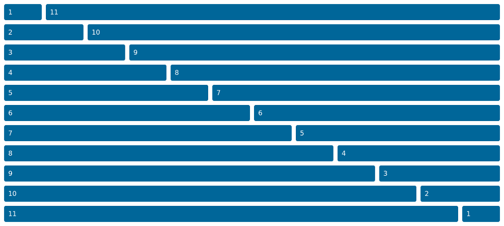
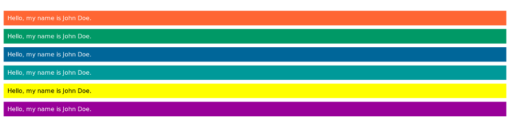

<p align="center">
	
</p>

# Overview

Lightweight CSS boilerplate built with Sass for easier configuration of grid, colors and media queries.

## Usage

Just download [minimalist.css](css/minimalist.css) and include it in your HTML file:

```
<meta name="viewport" content="width=device-width, initial-scale=1">
<link rel="stylesheet" href="minimalist.css">
```

## Documentation

Basic functionalities:

- Responsive grid system
- Color theme

### Grid system



This boilerplate provides basic responsive grid system similiar to the one in [Bootstrap 3](https://getbootstrap.com/). Default number of columns is 12, but that can be changed inside [_layout.scss](sass/_layout.scss) by editing `$columns` variable.

Usage example:

```
<div class="row">
	<section class="col-md-8 col-sm-12">Section</section>
	<aside class="col-md-4 col-sm-12">Aside</aside>
</div>
```

Initially, only `md` (medium) and `sm` (small) classes are available. To define new, add new `$breakpoint` variable in [main.scss](sass/main.scss) and replicate classes generation code in [_layout.scss](sass/_layout.scss) with appropriate changes (e.g. changing `sm` to new breakpoint name).

### Colors



All colors are defined inside [main.scss](sass/main.scss) inside `$colors` variable, which is Sass map data type. Mixins used for generating color classes can be found inside [_theme.scss](sass/_theme.scss).

Usage example:

```
<p class="bg-blue text-white padded">Hello, my name is John Doe.</p>
```

### Responsive tables

Usage example:

```
<div class="table-responsive">
	<table>
	...
	</table>
</div>
```
