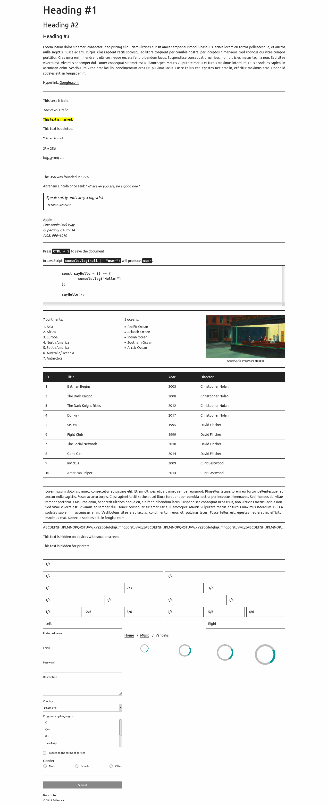

<p align="center">
	
</p>

<p align="center">
	
</p>

# Overview

Lightweight CSS framework built with Sass for easier configuration of grid, colors and media queries. It's purely CSS, no JavaScript - you just need to include one CSS file in your project to use it.

## Requirements

- [Sass](https://sass-lang.com/) - for development

## Usage

Just download [minimalizr.css](dist/minimalizr.css) and include it in your HTML file:

```
<meta name="viewport" content="width=device-width, initial-scale=1">
<link rel="stylesheet" href="css/minimalizr.css">
```

## Preview


