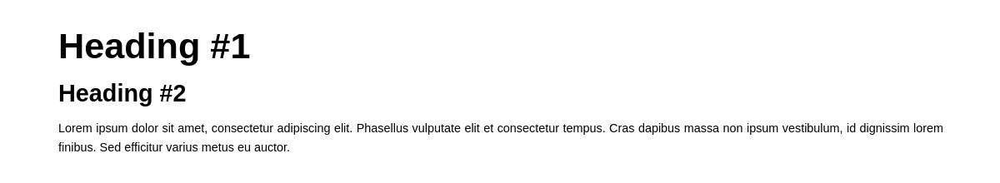

<p align="center">
	
</p>

# Overview

Lightweight CSS framework built with Sass for easier configuration of grid, colors and media queries. It's purely CSS, no JavaScript - you just need to include one .css file in your project to use it.

## Requirements

- [Sass](https://sass-lang.com/) - for development

## Usage

Just download [minimalizr.css](css/minimalizr.css) and include it in your HTML file:

```
<meta name="viewport" content="width=device-width, initial-scale=1">
<link rel="stylesheet" href="css/minimalizr.css">
```

## Documentation

Basic functionalities:

- Responsive grid system
- Color theme
- Responsive tables
- Basic styling for forms and buttons
- Other basic components like spinners, breadcrumbs etc.

Full page screenshot: [**here**](FULLPAGE.md).

### Text



This framework use Golden Ratio between `line-height` and `font-size` CSS properties. For example, when `font-size` is set to 1rem, `line-height` will be 1.6rem.

### Grid system


This framework provides basic responsive grid system similiar to the one in [Bootstrap 3](https://getbootstrap.com/). Default number of columns is 12, but that can be changed inside [_layout.scss](sass/_layout.scss) by editing `$columns` variable.

Usage example:

```
<div class="container">
	<div class="row">
		<section class="col-md-8 col-sm-12">Section</section>
		<aside class="col-md-4 col-sm-12">Aside</aside>
	</div>
</div>
```

Initially, only `md` (medium) and `sm` (small) classes are available. To define new, add new `$breakpoint` variable in [main.scss](sass/main.scss) and replicate classes generation code in [_layout.scss](sass/_layout.scss) with appropriate changes (e.g. changing `sm` to new breakpoint name).

### Colors


All colors are defined inside [main.scss](sass/main.scss) inside `$colors` variable, which is Sass map data type. Mixins used for generating color classes can be found inside [_theme.scss](sass/_theme.scss).

Usage example:

```
<p class="bg-blue text-white padded">Hello, my name is John Doe.</p>
```

### Buttons

When it comes to buttons, three different styles are provided: normal button, disabled button and submit button. You can use `bg-*` and `text-*` classes for custom background/foreground color.

```
<button type="button">Normal button</button>
<button type="submit">Submit button</button>
<button type="reset">Reset button</button>
<button type="button" disabled>Disabled button</button>
```

### Breadcrumbs


You can customize breadcrumbs properties inside [_breadcrumbs.scss](sass/components/_breadcrumbs.scss).

Usage example (note that the last `a` element is missing `href` attribute - don't worry, this markup will still comply [W3 specification](https://www.w3.org/TR/2011/WD-html5-20110525/links.html#attr-hyperlink-href)):

```
<ul class="breadcrumbs">
	<li>
		<a href="#">Home</a>
	</li>
	<li>
		<a href="#">Music</a>
	</li>
	<li>
		<a>Vangelis</a>
	</li>
</ul>
```
