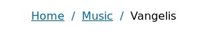

<p align="center">
	
</p>

# Overview

Lightweight CSS boilerplate built with Sass for easier configuration of grid, colors and media queries.

## Requirements

- [Sass](https://sass-lang.com/) - for development

## Usage

Just download [minimalizr.css](css/minimalizr.css) and include it in your HTML file:

```
<meta name="viewport" content="width=device-width, initial-scale=1">
<link rel="stylesheet" href="css/minimalizr.css">
```

## Documentation

Basic functionalities:

- Responsive grid system
- Color theme
- Responsive tables
- Basic styling for forms and buttons
- Other basic components like spinners, breadcrumbs etc.

### Grid system


This boilerplate provides basic responsive grid system similiar to the one in [Bootstrap 3](https://getbootstrap.com/). Default number of columns is 12, but that can be changed inside [_layout.scss](sass/_layout.scss) by editing `$columns` variable.

Usage example:

```
<div class="row">
	<section class="col-md-8 col-sm-12">Section</section>
	<aside class="col-md-4 col-sm-12">Aside</aside>
</div>
```

Initially, only `md` (medium) and `sm` (small) classes are available. To define new, add new `$breakpoint` variable in [main.scss](sass/main.scss) and replicate classes generation code in [_layout.scss](sass/_layout.scss) with appropriate changes (e.g. changing `sm` to new breakpoint name).

### Colors


All colors are defined inside [main.scss](sass/main.scss) inside `$colors` variable, which is Sass map data type. Mixins used for generating color classes can be found inside [_theme.scss](sass/_theme.scss).

Usage example:

```
<p class="bg-blue text-white padded">Hello, my name is John Doe.</p>
```

### Responsive tables

Usage example:

```
<div class="table-responsive">
	<table>
	...
	</table>
</div>
```

### Form

Usage example:

```
<form>
	<label>
		<span>Name</span>
		<input type="text" required>
	</label>
	<label>
		<span>Country</span>
		<select>
			<option value="rs" checked>Serbia</option>
			<option value="mn">Montenegro</option>
			<option value="ba">Bosnia and Herzegovina</option>
		</select>
	</label>
	<label>
		<span>Comment</span>
		<textarea></textarea>
	</label>
	<label class="form-checkbox">
		<span>I agree to the privacy policy</span>
		<input type="checkbox">
	</label>
	<hr>
	<button type="submit">Submit</button>
</form>
```

### Spinners


You can customize spinner properties inside [_spinner.scss](sass/components/_spinner.scss).

Usage example:

```
<div class="spinner"></div>
```

### Breadcrumbs



You can customize breadcrumbs properties inside [_breadcrumbs.scss](sass/components/_breadcrumbs.scss).

Usage example (note that the last `a` element is missing `href` attribute - don't worry, this markup will still comply [W3 specification](https://www.w3.org/TR/2011/WD-html5-20110525/links.html#attr-hyperlink-href)):

```
<div class="breadcrumbs">
	<a href="#">Home</a>
	<a href="#">Music</a>
	<a>Vangelis</a>
</div>
```
